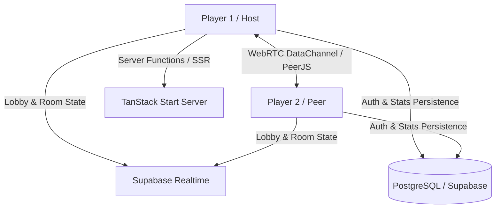

# PlayQuoridor ??

> Real-time multiplayer web adaptation of the classic abstract strategy game Quoridor, featuring low-latency WebRTC P2P gameplay, Supabase matchmaking lobbies, tactical move evaluation, and TanStack Start SSR architecture.

[](https://www.typescriptlang.org/)
[](https://react.dev/)
[](https://tanstack.com/start)
[](https://peerjs.com/)
[](https://tailwindcss.com/)

---

## ?? Features

- **P2P Multiplayer Game Engine:** Direct browser-to-browser WebRTC data channel synchronization via PeerJS for instant move dispatch without server latency.
- **Matchmaking & Lobbies:** Instant matchmaking, private room creation with 6-character room codes, and spectator mode powered by Supabase Realtime channels.
- **Custom Rule Configurations:** Customizable wall limits (1–10 walls), turn countdown timers, 2-player and 4-player modes.
- **Graph Pathfinding & Move Validation:** BFS/A* validation prevents illegal walls that fully trap any player from reaching their goal edge.
- **Tactical Analysis Engine:** Post-move BFS path-delta computation and automated coaching summaries.
- **Bot Engine:** Dynamic difficulty bot supporting single-player practice.

---

## ??? Architecture



---

## ?? Tech Stack

- **Framework:** TanStack Start (SSR), TanStack Router, React 19, TypeScript
- **Networking:** PeerJS (WebRTC), Supabase Realtime
- **Database & Auth:** Supabase (PostgreSQL, Supabase Auth, Row Level Security)
- **UI & Animation:** Tailwind CSS v4, Radix UI Primitives, Framer Motion, Lucide Icons
- **State & Data Fetching:** TanStack React Query v5, Zod schemas

---

## ?? Getting Started

### Prerequisites
- Node.js 20+
- npm or bun

### Setup

1. Clone repository:
   ```bash
   git clone https://github.com/franciscomcac/playquoridor.git
   cd playquoridor
   ```

2. Install dependencies:
   ```bash
   npm install
   ```

3. Configure environment:
   ```bash
   cp .env.example .env
   ```
   Fill in your Supabase project credentials in `.env`.

4. Start development server:
   ```bash
   npm run dev
   ```

5. Build for production:
   ```bash
   npm run build
   ```

---

## ?? License
This project is licensed under the MIT License - see the LICENSE file for details.
